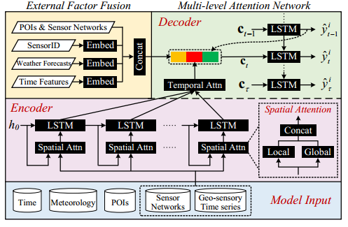

GeoMAN
======
[GeoMAN](https://github.com/yoshall/GeoMAN): Multi-level Attention Networks for Geo-sensory Time Series Prediction.

*An easy implement of GeoMAN, Tested on `CentOS 7` and `Windows Server 2012 R2`.*

## Paper 
[Yuxuan Liang](http://yuxuanliang.com), Songyu Ke, Junbo Zhang, Xiuwen Yi, [Yu Zheng](http://urban-computing.com/yuzheng), "[GeoMAN: Multi-level Attention Networks for Geo-sensory Time Series Prediction](http://yuxuanliang.com/assets/pdf/ijcai-18.pdf)", IJCAI 2018.

If you find this code useful for your research, please cite our paper:

```
@article{liang2018geoman,
  title={GeoMAN: Multi-level Attention Networks for Geo-sensory Time Series Prediction},
  author={Liang, Yuxuan and Ke, Songyu and Zhang, Junbo and Yi, Xiuwen and Zheng, Yu},
  booktitle={IJCAI},
  year={2018}
}
```

## Framework


## Code Usage
### Prelimary
GeoMAN uses the following dependencies: 
* [TensorFlow](https://github.com/tensorflow/tensorflow#download-and-setup) > 1.2.0
* numpy and scipy.
* CUDA 8.0 or latest version. And **cuDNN** is highly recommended. 

### Guide
The model implement mainly lies in "GeoMAN.py" and "base_model.py" and both of them are well commented. To train or test our model, please follow the presented notebooks.

### License
GeoMAN is released under the MIT License (refer to the LICENSE file for details).
